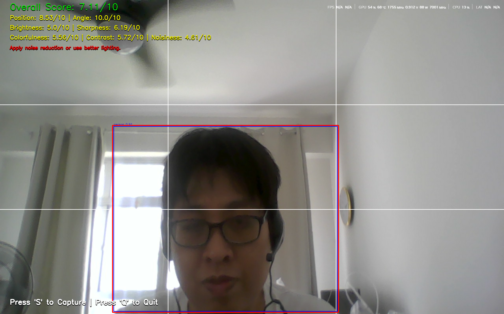

# AI Guided Camera



## Introduction
AI Guided Camera 

## Installation

To get started, first install the required dependencies:

```bash
pip install torch torchvision torchaudio --index-url https://download.pytorch.org/whl/cu126
pip install opencv-python numpy ultralytics 
```

## Model Files
Download necessary AI model files from the following link:

[📥 Download Models](https://drive.google.com/file/d/1FO4ATC3l8Nfq-KXi0yXQfv8IAKvFJpX9/view?usp=sharing)

Extract and place only MT-A_release.pt model to project folder

## GPU Support
This application requires GPU support for optimal performance, especially for:
- **torch**

Ensure your environment supports CUDA before installation.

## Features
- Real-time guidance and suggestions for improving photo quality using **SPAQ** and position with **Yolo**(e.g., optimal positioning of the main subject) 

## Credit
- [SPAQ](https://github.com/h4nwei/SPAQ)
- [Yolo](https://github.com/ultralytics/ultralytics)


